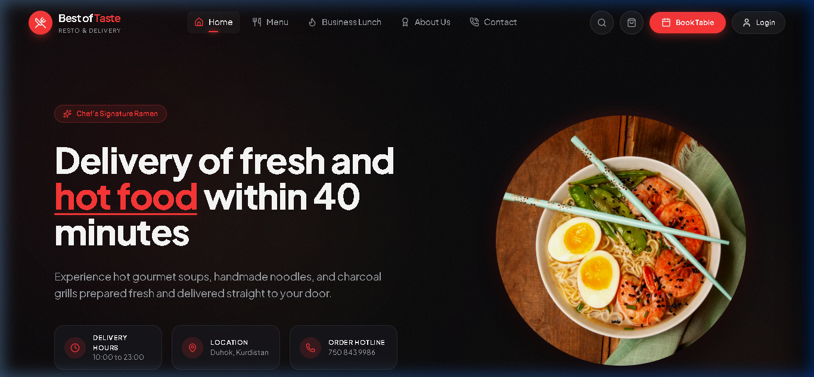
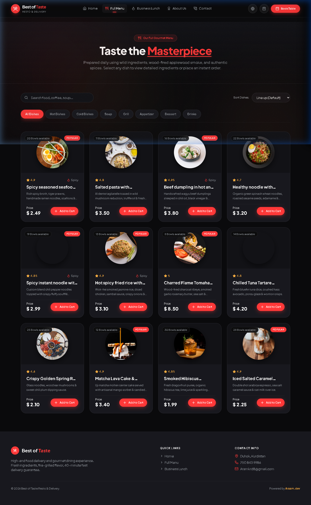
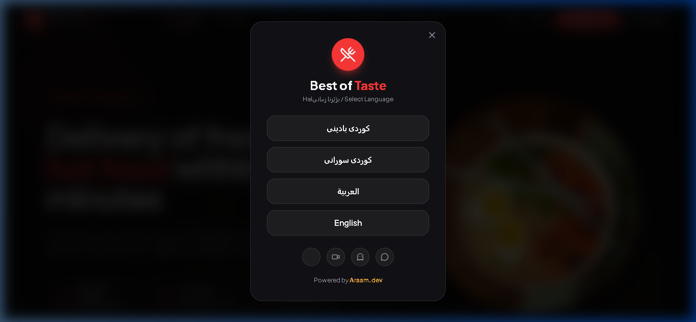

# 🍜 Best of Taste — Gourmet Resto & Delivery


A ultra-modern, high-end single-page & multi-screen web application designed for a luxury gourmet restaurant and food delivery platform. Built with **Vanilla JavaScript**, **Tailwind CSS**, **GSAP Animations**, and **Lucide Icons**, featuring an ambient dark luxury theme and full 4-language localization support.

---

## 📸 Screenshots Showcase

### 1. Main Landing Page & Hero Slider


### 2. Standalone Full Gourmet Menu (`menu.html`)


### 3. Multilingual Selection Screen (RTL & LTR Ready)


---

## ✨ Key Features

- **🌐 Multilingual Translation Engine**:
  - Supports **Kurdish Badini (كوردی بادینی)**, **Kurdish Sorani (كوردی سورانی)**, **Arabic (العربية)**, and **English**.
  - Automatically toggles page direction between **RTL** (Right-to-Left) and **LTR** (Left-to-Right).
  - Dynamically updates category filters, search input placeholders, price sorting dropdowns, dish names, and dish descriptions.
  - Remembers user choice across page reloads using `localStorage` and URL parameters (`?lang=...`).

- **✨ Dark Luxury Ambient Aesthetic**:
  - Hardware-accelerated floating glow orbs and subtle noise pattern overlay.
  - Backdrop blur glassmorphism header that automatically shrinks and becomes semi-transparent on page scroll.

- **📱 Mobile-First Responsive Drawer Navigation**:
  - Smooth slide-out mobile menu drawer with intuitive navigation controls.

- **🍜 Full Gourmet Menu & Real-Time Filtering**:
  - Filter dishes by category (*Hot Dishes, Cold Dishes, Soup, Grill, Appetizer, Dessert, Drinks*).
  - Instant live search by keyword.
  - Dynamic sorting by price (*Low to High / High to Low*) and top rating.

- **🖼️ Dish Detail Modal Overlay**:
  - Click any food card to open a full dish detail view with high-res images, ratings, spice indicators, portion counts, and descriptions.

- **🛒 Interactive Shopping Cart Side Drawer**:
  - Live quantity adjustment (`+` / `-`), subtotal & 5% delivery tax calculation, item removal, and checkout simulation.

- **📅 Table Reservation Modal**:
  - Interactive table booking form with instant toast notifications.

---

## 🛠️ Technology Stack

- **Markup & Styling**: HTML5, Vanilla CSS, Tailwind CSS CDN
- **Logic & Interactions**: Vanilla JavaScript (ES6+)
- **Animations**: GSAP (GreenSock Animation Platform) & ScrollTrigger
- **Iconography**: Lucide Icons
- **Typography**: Google Fonts (*Outfit* & *Plus Jakarta Sans*) with RTL Arabic/Kurdish fallbacks

---

## 🚀 Getting Started

1. **Clone the repository**:
   ```bash
   git clone https://github.com/Aram108/best-of-taste-restaurant.git
   cd best-of-taste-restaurant
   ```

2. **Run Locally**:
   - Open `index.html` with **Live Server** (e.g. `http://127.0.0.1:5500` or `http://localhost:8080`).

---

## 👨‍💻 Developer & Contact Info

- **Developer**: [Araam.dev](https://araam-dev.vercel.app)
- **GitHub**: [Aram108](https://github.com/Aram108)
- **Location**: Duhok, Kurdistan
- **Phone / WhatsApp**: [+964 750 843 9986](https://wa.me/9647508439986)
- **Email**: [Aramkrd8@gmail.com](mailto:Aramkrd8@gmail.com)

---

&copy; 2026 **Best of Taste Resto & Delivery**. All Rights Reserved. Powered by **[Araam.dev](https://araam-dev.vercel.app)**.

